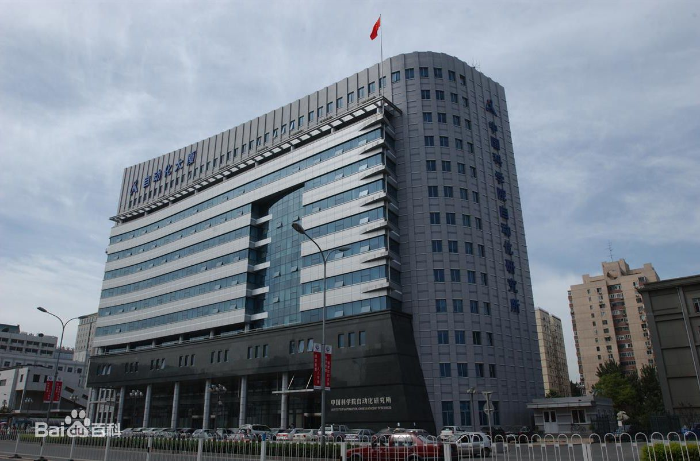

# 人工智能工作记录

## 中国科学院自动化研究所（Institute of Automation，Chinese Academy of Sciences）

> 学习计划表 -> [SCHEDULE](https://github.com/usiege/CASIA/blob/master/SCHEDULE.md)

### 2019-03-08

### 2019-03-06

- [Pointnet 说明](http://www.python88.com/topic/28079)
- [Pointnet 中文翻译](https://www.zybuluo.com/usiege/note/1405465)

### 2019-03-05

- [VoxelNet 翻译](https://zhuanlan.zhihu.com/p/27896452)
- [SqueezeSeg 翻译](https://www.zybuluo.com/usiege/note/1268607)
- [SqueezeSegV2 翻译](https://www.zybuluo.com/usiege/note/1407175)

### 2019-03-04

- [SIFT算法](https://blog.csdn.net/lingyunxianhe/article/details/79063547)

### 2019-03-01

- [跟随大佬的脚步](http://www.cnblogs.com/charlotte77/p/6178699.html)
- [SequenceNet论文翻译](https://blog.csdn.net/u014540717/article/details/53397029)
- [lenet论文翻译部分](https://blog.csdn.net/qianqing13579/article/details/71076261#lenet论文翻译)

### 2009-02

本月有两周放假~

- [二月第一周](https://github.com/usiege/CASIA/blob/master/2019-02-第一周.md)
- [二月第二周](https://github.com/usiege/CASIA/blob/master/2019-02-第二周.md)

### 2019-02-28

- [A list of references on lidar point cloud processing for autonomous driving](https://github.com/beedotkiran/Lidar_For_AD_references)
- [Alexnet 中文翻译](https://asdfv1929.github.io/2017/12/31/alexnet/)

### 2019-02-27

- [LeNet论文的翻译与CNN三大核心思想的解读](https://blog.csdn.net/qianqing13579/article/details/71076261)
- [Fully Convolutional Networks for semantic Segmentation（深度学习经典论文翻译）](https://www.cnblogs.com/xuanxufeng/p/6249834.html)

### 2019-02-26

- [激光反射强度 intensity](http://desktop.arcgis.com/zh-cn/arcmap/latest/manage-data/las-dataset/what-is-intensity-data-.htm) 
- [单目视频无监督深度学习的结构化方法 ](http://www.sohu.com/a/281308640_670669)
- [shadowsocks](https://shadowsocks.org/en/download/clients.html)

### 2019-02-18

- 解决数据分布不均衡问题，[Focal loss](https://zhuanlan.zhihu.com/p/32423092)
- [SqueezeSegV2](https://github.com/xuanyuzhou98/SqueezeSegV2)
- [SqueezeSeg](https://github.com/BichenWuUCB/SqueezeSeg)

### 2019-01-28

- 19年了；

- [一月第一周](https://github.com/usiege/CASIA/blob/master/2019-01-第一周.md)
- [一月第二周](https://github.com/usiege/CASIA/blob/master/2019-01-第二周.md)
- [一月第三周](https://github.com/usiege/CASIA/blob/master/2019-01-第三周.md)
- [一月第四周](https://github.com/usiege/CASIA/blob/master/2019-01-第四周.md)

### 2019-01-18

- 添加了2019年学习计划表，[链接](https://github.com/usiege/CASIA/blob/master/SCHEDULE.md)，为2020年初做长足准备，转行需要补太多知识了，要有准备有计划的进行；

### 2019-01-08

- [R-CNN、Fast/Faster/Mask R-CNN、FCN、RFCN 、SSD原理简析](https://zhuanlan.zhihu.com/p/47579399)
- [RFCN-tensorflow 源码](https://github.com/xdever/RFCN-tensorflow)

### 2019-01-03

- 开题PPT修改，格式注意点
- [计算机视觉四大基本任务(分类、定位、检测、分割)](https://zhuanlan.zhihu.com/p/31727402)

### 2018-12-29

- [十二月第一周](https://github.com/usiege/CASIA/blob/master/2018-12-第一周.md)
- [十二月第二周](https://github.com/usiege/CASIA/blob/master/2018-12-第二周.md)
- [十二月第三周](https://github.com/usiege/CASIA/blob/master/2018-12-第三周.md)
- [十二月第四周](https://github.com/usiege/CASIA/blob/master/2018-12-第四周.md)

### 2018-12-27

* [R-CNN、Fast/Faster/Mask R-CNN、FCN、RFCN 、SSD原理简析](https://zhuanlan.zhihu.com/p/47579399)
* [SUN RGB-D: A RGB-D Scene Understanding Benchmark Suite](http://rgbd.cs.princeton.edu/paper.pdf)
* [Lidar-based Methods for Tracking and Identification](http://publications.lib.chalmers.se/records/fulltext/241972/241972.pdf)

### 2018-12-25

* [花了10分钟，终于弄懂了特征值和特征向量](http://mini.eastday.com/bdmip/180328092726628.html)

* [经典CNN结构简析：AlexNet、VGG、NIN、GoogLeNet、ResNet etc.](https://zhuanlan.zhihu.com/p/47391705)
* [R-CNN、Fast/Faster/Mask R-CNN、FCN、RFCN 、SSD原理简析](https://zhuanlan.zhihu.com/p/47579399)

- 今日备忘
	1. 使用xmanager，在客户端也能看到服务器的界面（win下；

### 2018-12-24

* 主成分分析（PCA）（未完成
* 特征值与特征向量（未完成

* 添加了win下的Endnote x7软件，该软件是用于文献管理的，可直接与word配合使用；

### 2018-12-23

* [10大称霸Kaggle的深度学习技巧（附课程&代码&论文）](https://blog.csdn.net/tMb8Z9Vdm66wH68VX1/article/details/81572344)
* [CNN卷积神经网络的经典网络](http://www.cnblogs.com/guoyaohua/p/8534077.html)

### 2018-12-22

* 点云阶段总结材料
	1. [自动驾驶与视觉感知](https://zhuanlan.zhihu.com/c_211994536?utm_medium=social&utm_source=wechat_timeline&from=timeline&isappinstalled=0)
	2. [点云感知 CVPR 2018 论文总结](https://zhuanlan.zhihu.com/p/41287237)
	3. [无人驾驶与视觉感知导读（持续更新）](https://zhuanlan.zhihu.com/p/41460767)
	4. [三维深度学习中的目标分类与语义分割](https://zhuanlan.zhihu.com/p/46742217)
	5. [CreativeAI 3D (Geometric) Domain](http://geometry.cs.ucl.ac.uk/creativeai/)

### 2018-12-21

* [CreativeAI: Deep Learning for Graphics](http://geometry.cs.ucl.ac.uk/creativeai/)

### 2018-12-20

* [Deep-Feature-Flow](https://github.com/msracver/Deep-Feature-Flow)
* [RFCN](https://github.com/YuwenXiong/py-R-FCN)
* [MXNet（C++）](https://github.com/apache/incubator-mxnet)

### 2018-12-18

* [py-MDNet tracking](https://github.com/HyeonseobNam/py-MDNet)

### 2018-12-16

* [点云感知 CVPR 2018 论文总结](https://zhuanlan.zhihu.com/p/41287237)
* [三维深度学习中的目标分类与语义分割](https://zhuanlan.zhihu.com/p/46742217)

### 2018-12-15

* [VoxelNet: 基于点云的三维空间信息逐层次学习网络](https://zhuanlan.zhihu.com/p/40051716)
* [无人驾驶与视觉感知导读（持续更新）](https://zhuanlan.zhihu.com/p/41460767)

### 2018-12-13

* [图片标识工具labeltool](https://blog.csdn.net/wuzuyu365/article/details/52523061)

* [图片标识工具LabelImg](https://blog.csdn.net/xingwei_09/article/details/79171452)
* [PyInstaller](http://www.pyinstaller.org)

* [py-MDNet](https://github.com/HyeonseobNam/py-MDNet)
* [Learning Multi-Domain Convolutional Neural Networks for Visual Tracking](http://cvlab.postech.ac.kr/research/mdnet/)

### 2018-12-09

* [CCF BDCI2018：阿里巴巴集团自动驾驶三维点云分割第四名方案（10fps on 1080）](https://zhuanlan.zhihu.com/p/51508500)

* [CVPR2017精彩论文解读：直接处理三维点云的深度学习模型](https://www.leiphone.com/news/201708/ehaRP2W7JpF1jG0P.htm)

### 2018-12-08

* [从点云到网格（一）](https://www.cnblogs.com/luyb/p/5646143.html)
* [点云及PCL编程基础](https://mp.weixin.qq.com/s/hUaCidt6XxPCI_Dj6tC0bA)

### 2018-12-06

> 论文阅读方法

> 标注使用方法： 福昕阅读器有多颜色标注，每读一遍使用一种颜色标注；

* [Volumetric and Multi-View CNNs for Object Classification on 3D Data](https://blog.csdn.net/u010167269/article/details/51452297) (基于多视角方法

* [VoxNet: A 3D Convolutional Neural Network for real-time object recognition](https://ieeexplore.ieee.org/document/7353481?denied=) (基于体素
* [3D ShapeNets: A Deep Representation for Volumetric Shapes](https://arxiv.org/abs/1406.5670) (基于体素

* 点云直接转换 CVPR 2017 PointNet PointNet++

* [特征表达与特征关系](http://58.20.53.45/files/files_upload/content/material_134/content/002002002002001002002001001/)
* [特征工程之特征选择](https://www.cnblogs.com/pinard/p/9032759.html)
* [特征工程之特征表达](https://www.cnblogs.com/pinard/p/9061549.html)

### 2018-12-05

- [BDCI2018：阿里巴巴集团自动驾驶三维点云分割第四名方案，可能是国内第一个要求实时性的比赛](https://zhuanlan.zhihu.com/p/51508500)
- [占据栅格地图（Occupancy Grid Map）](https://zhuanlan.zhihu.com/p/21738718)

### 2018-12-04

* [斯坦福学者首次提出直接处理三维点云的深度学习模型](https://zhuanlan.zhihu.com/p/37322469)
* [VoxelNet: 基于点云的三维空间信息逐层次学习网络](https://zhuanlan.zhihu.com/p/40051716)
* [PCL点云特征描述与提取（1）](https://www.cnblogs.com/li-yao7758258/p/6479255.html)
* [PCL点云特征描述与提取（2）](https://www.cnblogs.com/li-yao7758258/p/6481668.html)
* [PCL点云特征描述与提取（3）](https://www.cnblogs.com/li-yao7758258/p/6481738.html)

### 2018-11-23

* [无人驾驶汽车系统入门：基于深度学习的实时激光雷达点云目标检测及ROS实现...](https://blog.csdn.net/dQCFKyQDXYm3F8rB0/article/details/83745697)

* [Pointwise原文](https://github.com/usiege/CASIA/blob/master/paper-pointcloud/Pointwise%20Convolutional%20Neural%20Networks.pdf)

- [十一月第一周](https://github.com/usiege/CASIA/blob/master/2018-11-第一周.md)
- [十一月第二周](https://github.com/usiege/CASIA/blob/master/2018-11-第二周.md)
- [十一月第三周](https://github.com/usiege/CASIA/blob/master/2018-11-第三周.md)
- [十一月第四周](https://github.com/usiege/CASIA/blob/master/2018-11-第四周.md)

### 2018-11-21

* [PointNet翻译](https://blog.csdn.net/weixin_42137840/article/details/81200341)
* [PointNet原文](https://github.com/usiege/CASIA/blob/master/paper-pointcloud/PointNet%20Deep%20Learning%20on%20Point%20Sets%20for%203D%20Classification%20and%20Segmentation.pdf)

### 2018-11-20
* [kaggle](https://www.jianshu.com/p/f648de991d51)
* [Human Protein Atlas Image Classification](https://www.kaggle.com/c/human-protein-atlas-image-classification/kernels)

* [吴恩达深度学习作业](https://www.jianshu.com/p/769fc6fe9b0a)
* [上例补充](https://github.com/stormstone/deeplearning.ai)
* [本人作业地址](https://github.com/usiege/CASIA/tree/master/homework)

### 2018-11-16
* [无人驾驶汽车系统入门：基于深度学习的实时激光雷达点云目标检测及ROS实现...](https://blog.csdn.net/dQCFKyQDXYm3F8rB0/article/details/83745697)
* [LIDAR-based 3D Object%20Percepti](https://github.com/usiege/CASIA/blob/master/paper-pointcloud/LIDAR-based%203D%20Object%20Perception.pdf)

### 2018-11-13
* [【论文翻译】Kinectv2 for Mobile Robot Navigation: Evaluationand Modeling](https://blog.csdn.net/hehedadaq/article/details/80567192)

### 2018-11-12
* [Analysis of the Accuracy and Robustness of the Leap
Motion Controller](https://github.com/usiege/CASIA/blob/master/paper-pointcloud/sensors-13-06380.pdf)
这是关于LeapMotion精度问题的一篇文章
* [关于kinectv2性能分析的一些论文](https://blog.csdn.net/jiaojialulu/article/details/52858268)

### 2018-11-10

* [InfiniTAM](https://github.com/uwuneng/InfiniTAM)
InfiniTAM是一个开源、跨平台、实时的大范围深度信息融合与跟踪技术框架。

* [InfiniTAM v3: A Framework for Large-Scale 3D Reconstruction with Loop Closure](https://arxiv.org/abs/1708.00783)
* [A Framework for the Volumetric Integration of Depth Images](http://www.robots.ox.ac.uk/%7Evictor/infinitam/files/itmtechreport_20141027.pdf)

### 2018-11-07
* [流畅的python](https://github.com/usiege/Python/blob/master/流畅的python.pdf)

### 2018-11-06
* [Tensorflow空洞卷积的实现](https://blog.csdn.net/mao_xiao_feng/article/details/77924003)
* [tensorflow fine-tune部分网络层参数实现](https://blog.csdn.net/fk1174/article/details/79731080)

### 2018-11-04
* [LIDAR-based 3D Object Perception](https://github.com/usiege/CASIA/blob/master/paper-pointcloud/LIDAR-based%203D%20Object%20Perception.pdf)
* [李宏毅机器学习](https://github.com/usiege/Machine-Learning/blob/master/lihongyi-tw/李宏毅机器学习.pdf)

### 2018-11-02
* [吴恩达机器学习Yearing](https://github.com/usiege/Machine-Learning/blob/master/wuenda/NG18中文版.pdf)

### 2018-10-31

- [十月第四周](https://github.com/usiege/CASIA/blob/master/2018-10-第四周.md)
* [如何进行fine-tune（tensorflow实现）](https://blog.csdn.net/fk1174/article/details/79731080)

### 2018-10-22
* [ImageNet Classification with Deep Convolutional Neural Networks论文翻译](https://blog.csdn.net/quincuntial/article/details/75668467)

### 2018-10-19
* [10月第三周总结](https://github.com/usiege/CASIA/blob/master/2018-10-第三周.md)
* 关于点云识别的传统方法有基于特征点的识别（用描述符），[相关论文]()

### 2018-10-18
* [3D Convolutional Neural Networks for Human Action Recognition](https://blog.csdn.net/liuxiao214/article/details/78066243)
* [KITTI 3D DataSet](http://www.cvlibs.net/datasets/kitti/eval_object.php?obj_benchmark=3d)
* [Deep Reinforcement Learning](https://arxiv.org/abs/1810.06339)

### 2018-10-17
[ImageNet Classification with Deep Convolutional Neural Networks](https://blog.csdn.net/quincuntial/article/details/75668467)

### 2018-10-16
[SqueezeSeg: 点云中三维物体的实时分割技术](https://zhuanlan.zhihu.com/p/43598102)

### 2018-10-15
[SqueezeNet: AlexNet-level accuracy with 50x fewer parameters](https://github.com/uwuneng/SqueezeNet)

### 2018-10-14

[Reinforcement Learning: An Introduction](https://github.com/ShangtongZhang/reinforcement-learning-an-introduction)

### 2018-10-12
* [10月第二周总结](https://github.com/usiege/CASIA/blob/master/2018-10-第二周.md)

### 2018-09-24

* 9月第三周总结，文档链接[9月第三周](https://github.com/usiege/CASIA/blob/master/2018-09-第三周.md)

### 2018-09-14

* 9月第二周总结，文档链接[9月第二周](https://github.com/usiege/CASIA/blob/master/2018-09-第二周.md)

* 添加了作业目录[cousera_DeepLearning-homework](https://github.com/usiege/Deep-Learning/cousera_DeepLearning-homework)

### 2018-09-07

* 9月第一周总结，文档链接[9月第一周](https://github.com/usiege/CASIA/blob/master/2018-09-第一周.md)

### 2018-08-31

* 8月周总结，SqueezeSeg翻译[链接](https://github.com/usiege/Deep-Learning/blob/master/SqueezeSeg-%20Convolutional%20Neural%20Nets%20with%20Recurrent%20CRF%20for%20Real-Time%20Road-Object%20Segmentation%20from%203D%20LiDAR%20Point%20Cloud.md)；
* 8月一周总结，[8月总结文档](https://github.com/usiege/CASIA/blob/master/2018-08-总结.md)

### 2018-08-30

* [3D Bounding Box Estimation Using Deep Learning and Geometry](https://blog.csdn.net/cuichuanchen3307/article/details/80970086)

### 2018-08-29

* 添加了李飞飞深度学习课程资料，链接[Lee feifei](https://github.com/usiege/Deep-Learning/tree/master/Lee%20feifei)
* SqueezeSeq翻译继续

### 2018-08-28

[SqueezeSeg: Convolutional Neural Nets with Recurrent CRF for Real-Time Road-Object Segmentation from 3D LiDAR Point Cloud](https://github.com/uwuneng/SqueezeSeg) 

### 2018-08-27 

本地代码同步服务器，远程代码调拭

### 2018-08-24 到自动化所实习

研究课题：3D对象识别

### 2018-06-13
 * [吴恩达deeplearning深度学习pdf](https://github.com/usiege/Deep-Learning/blob/master/Deeplearning深度学习笔记v5.54.pdf)
 * [吴恩达deeplearning深度学习英文原版](https://github.com/usiege/Deep-Learning/blob/master/Programming%2BAssignments%2Bof%2BDeep%2BLearning%2BSpecialization%2B%25285%2Bcourses%2529.pdf)
 * [吴恩达机器学习笔记](https://github.com/uwuneng/Coursera-ML-AndrewNg-Notes)
 * [吴恩达deeplearning.ai作业资料](https://github.com/uwuneng/deeplearning.ai)

### 2018-05-28

 * [NIPS DRL CSDN关于Human-level的资料](https://blog.csdn.net/mydear_11000/article/details/51488118)
 * [Playing Atari with Deep Reinforcement Learning](https://github.com/usiege/CASIA/blob/master/paper-reinforcement/1312.5602v1%20Playing%20Atari.pdf)
 * [Human-level control through deep reinforcement learning](https://github.com/usiege/Deep-Learning/blob/master/paper/Human-level-control-through-deep-reinforcement.pdf) 

### 2018-05-27
   - [机器之心——NeuralNetwork](https://github.com/usiege/Deep-Learning/tree/master/0527-NeuralNetwork)   [（文章链接）](https://mp.weixin.qq.com/s/KJafSya1PVWM_o2EZ4xl6w)

### 2018-05-26
  - [RNNLM神经网络训练模型](https://github.com/usiege/Python/tree/master/ai-learning/npl-lesson3)

### 2018-05-22

 * [deeplearning.ai](http://deeplearning.ai)

### 2018-05-19

 * [StarCraft II: A New Challenge for Reinforcement Learning](https://github.com/usiege/CASIA/blob/master/paper-reinforcement/1708.04782%20StarCraft%20II%20RL.pdf)
 * [Multiagent Bidirectionally-Coordinated Nets
Emergence of Human-level Coordination in Learning to Play StarCraft Combat Games∗
](https://github.com/usiege/CASIA/blob/master/paper-reinforcement/1703.10069%20StarCraft%20BCN.pdf)
 * [StarCraft Micromanagement with Reinforcement
Learning and Curriculum Transfer Learning](https://github.com/usiege/CASIA/blob/master/paper-reinforcement/1804.00810%20StarCraft%20RLvsCTL.pdf)
 * [Feedback-Based Tree Search for Reinforcement Learning](https://github.com/usiege/CASIA/blob/master/paper-reinforcement/1805.05935%20FBTS%20RL.pdf)

### 2018-05-18 
  - [Youtube-Regression](https://www.youtube.com/watch?v=fegAeph9UaA&list=PLJV_el3uVTsPy9oCRY30oBPNLCo89yu49&index=2)

### 2018-05-14 
  - [Youtube-Regression](https://www.youtube.com/watch?v=fegAeph9UaA&list=PLJV_el3uVTsPy9oCRY30oBPNLCo89yu49&index=2);

### 2018-05-07 创建

添加了缪青海老师发送的开题报告样例；

## 其他Repositories

* [Deep-learning](https://github.com/usiege/Deep-Learning)
* [Machine-learning](https://github.com/usiege/Machine-Learning)

